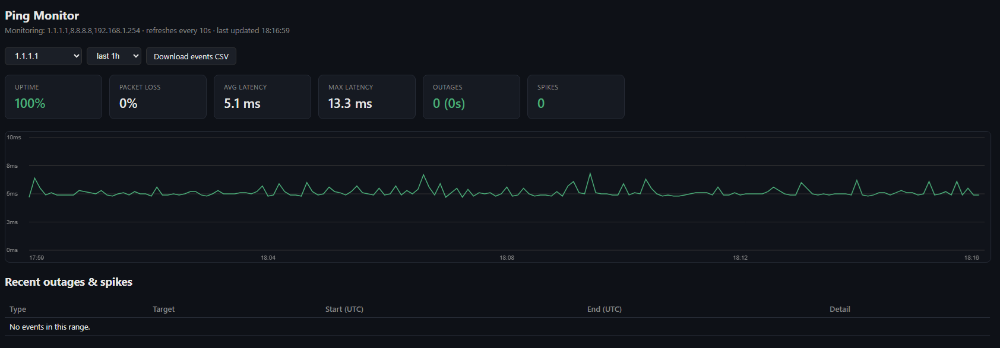

# Echo Watcher

A self-contained ping monitor: continuously pings a set of targets, logs every result to SQLite,
and flags outages and latency spikes with exact UTC timestamps. Built to get evidence of
intermittent connectivity problems an ISP claims not to see — a timestamped log instead of "it
feels laggy sometimes".

Single Docker container: background ping threads + a Flask dashboard in one process. No external
DB, no CDN dependencies — the dashboard's chart is hand-rolled vanilla JS/canvas so it works fully
offline.

## What it does

- Pings every target (default: `1.1.1.1`, `8.8.8.8`, and the LAN gateway `192.168.1.254`) once a
  second via the system `ping` binary.
- **Outage**: `OUTAGE_FAILS` (default 2) consecutive timeouts on a target opens an event, closed
  the moment a ping succeeds again, with duration.
- **Spike**: once a target has ≥5 successful samples, a ping counts as a spike if it exceeds
  `SPIKE_ABS_MS` (default 150ms) outright, or jumps `SPIKE_JITTER_MS` (default 40ms) above that
  target's rolling baseline (median of its last 20 successful pings).
- Dashboard at `:8531` — per-target/per-range (1h/24h/7d/30d) summary cards (uptime %, packet
  loss %, avg/max latency, outage/spike counts), a latency chart with loss bars, and a live
  outage/spike table.
- **Download events CSV** button (or `/export/events.csv`) — exportable, timestamped evidence.
- Pinging your router's gateway alongside public targets tells "my LAN/WiFi is flaky" apart from
  "problem is upstream of my router" — if only the public targets drop while the gateway stays up,
  it's the ISP's problem.



## Run it

```bash
docker compose up -d --build
```

Then open `http://<host>:8531`. Runs with `network_mode: host` by default (this deploys to a
Linux Docker host) so Docker's own bridge/NAT doesn't add jitter to the measurement — if running
on Windows/Mac Docker Desktop instead, swap that for a `ports: ["8531:8531"]` mapping in
`docker-compose.yml`.

Data persists in the `echo-watcher-data` named Docker volume — survives restarts/rebuilds.
`docker compose down -v` would wipe it, so don't run that unless you mean to lose the log.

## Config

All tunable via env vars — copy `.env.example` to `.env` and edit, everything has a default:

| Var | Default | Meaning |
|---|---|---|
| `TARGETS` | `1.1.1.1,8.8.8.8,192.168.1.254` | Comma-separated hosts to ping. |
| `INTERVAL` | `1` | Seconds between pings, per target. |
| `PING_TIMEOUT` | `1` | Seconds to wait for a reply before counting a timeout. |
| `OUTAGE_FAILS` | `2` | Consecutive timeouts before an outage event opens. |
| `SPIKE_ABS_MS` | `150` | Absolute latency (ms) that always counts as a spike. |
| `SPIKE_JITTER_MS` | `40` | Latency above the rolling baseline (ms) that counts as a spike. |
| `RETENTION_DAYS` | `14` | Raw ping samples older than this are pruned every 6h. Outage/spike events are kept forever. |
